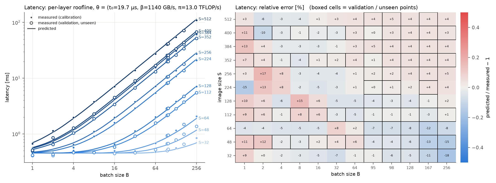
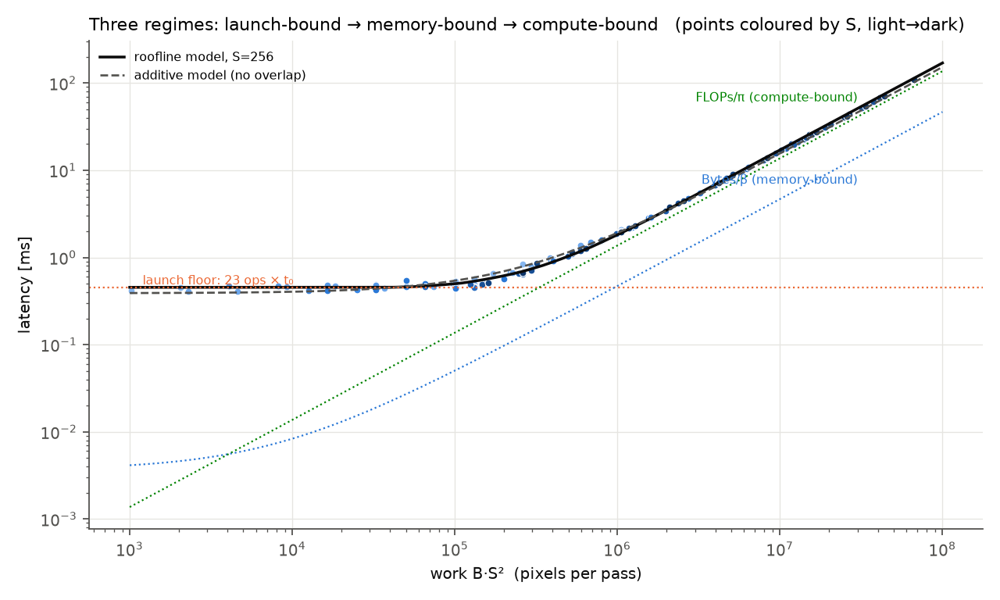
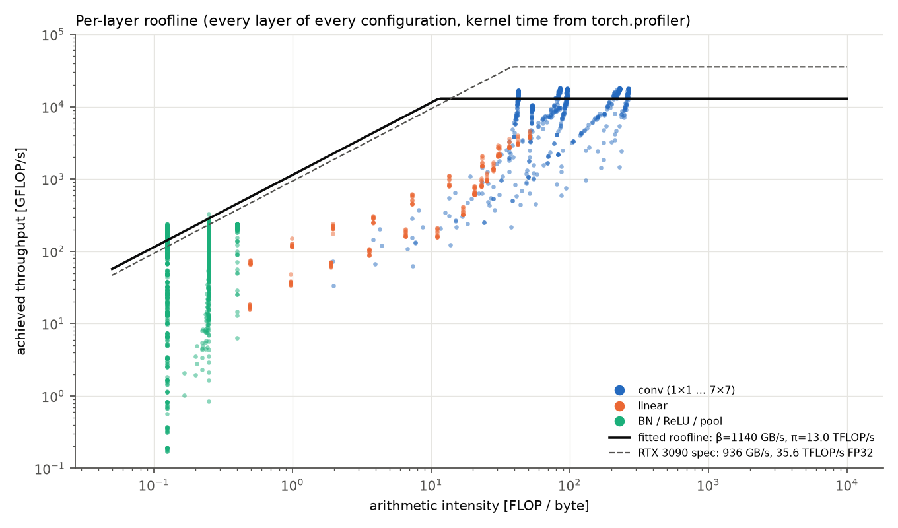
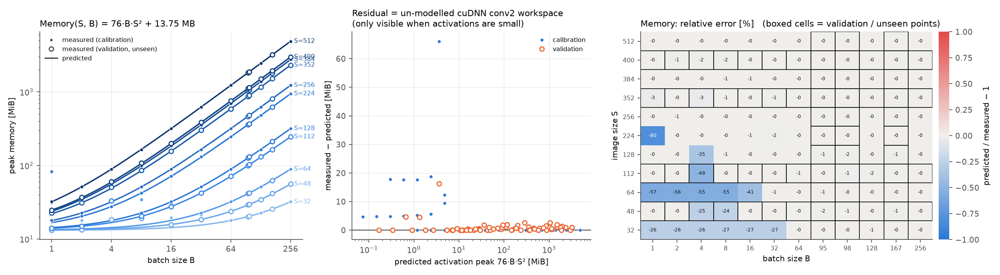
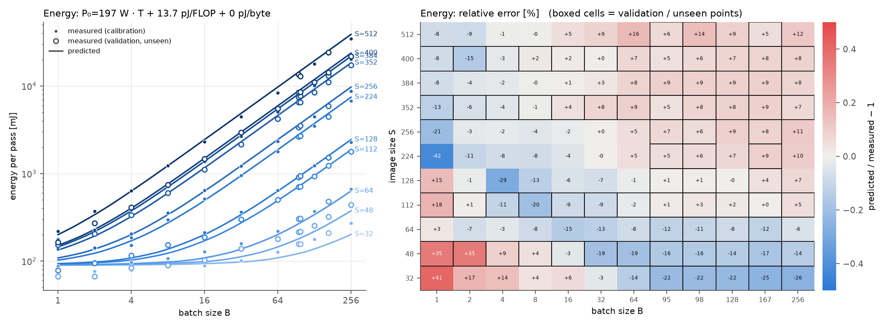

# HW1 — Analytical performance model of a small CNN

Closed-form `FLOPs(S,B)`, `Memory(S,B)`, `Latency(S,B,θ)`, `Energy(S,B,θ_E)` for the
7-conv "Model" of the assignment, calibrated and validated on an RTX 3090 over 132 (S, B) configurations.

```
hw1/
├── README.md                    this file
├── hw1_derivations_draft.pdf    typeset draft of the Part-1 derivations (to be copied by hand -> hw1_handwritten.pdf)
├── models.py                    the network (nn.Sequential, 24 modules)
├── equations.py                 flops(), memory(), bytes_moved(), latency(), energy()  — NumPy-broadcastable
├── measure.py                   measurement protocol (latency / memory / energy / kernels), OOM handling
├── calibrate.py                 fits θ and θ_E on the base grid, evaluates on the held-out points -> results/theta.json
├── plots.py                     all figures
├── derivations_pdf.py           generates the derivation draft
└── results/
    ├── measurements.csv         S, B, is_validation, oom, latency, memory, energy, power, clocks, profiler FLOPs
    ├── measurements_memlimit2gb.csv   same grid with the GPU limited to 2 GB (OOM check)
    ├── kernels.csv              S, B, layer, CUDA kernel name, duration (µs)   — 3932 rows
    ├── theta.json               fitted parameters + error metrics
    ├── env.json                 hardware / software / protocol constants
    └── figures/*.png
```

## 1. Environment

| | |
|---|---|
| GPU | NVIDIA GeForce RTX 3090, 24 GB GDDR6X, 82 SMs, 6 MB L2, power limit 350 W, max SM clock 2100 MHz |
| Driver / CUDA | 595.71.05 / CUDA 12.8 (torch build) |
| PyTorch / cuDNN | 2.11.0+cu128 / 9.19.0 |
| Python / OS | 3.12.13 / Ubuntu 22.04, Linux 6.8 |
| Flags | `cudnn.benchmark=False`, `cudnn.allow_tf32=False`, `cuda.matmul.allow_tf32=False`, `model.cuda().eval()`, `torch.inference_mode()`, FP32 |
| Idle power | 115 W (NVML, GPU idle at the P0 state, no other processes on the GPU) |
| Clocks | default boost; not locked (SM clock observed 1965 MHz at light load → 1395 MHz at the power limit) |

### How to reproduce

```bash
cd hw1
uv venv .venv && source .venv/bin/activate          # or python -m venv
uv pip install torch --index-url https://download.pytorch.org/whl/cu128
uv pip install -r requirements.txt                   # numpy pandas scipy matplotlib nvidia-ml-py
python measure.py                    # ~5 min: results/measurements.csv, results/kernels.csv, results/env.json
python measure.py --mem-limit-gb 2   # ~1 min: OOM check with an emulated 2 GB GPU
python calibrate.py                  # results/theta.json
python plots.py                      # results/figures/*.png
```

Grid (seed 2026): S ∈ {32, 64, 128, 224, 256, 384, 512} ∪ **{48, 112, 352, 400}**, B ∈ {1, 2, 4, …, 256} ∪ **{95, 98, 167}**.
A configuration is `is_validation = 1` if its S *or* B is one of the random (bold) values → 63 calibration points, 69 held-out points. θ, θ_E are fitted on the 63 only.

### Measurement protocol (identical for every configuration)

* **Memory** — `reset_peak_memory_stats()` after the input has been allocated, one forward, `max_memory_allocated()` (weights + input included). Recorded for a cold and a warm pass (they agree).
* **Latency** — 10 warm-up passes; then N timed passes, each `perf_counter` around `model(x)` + `torch.cuda.synchronize()`; **median**. N chosen so the timed block lasts ≥ 0.7 s (20 ≤ N ≤ 300).
* **Energy** — `nvmlDeviceGetTotalEnergyConsumption` (board energy counter, mJ) read before/after a loop of K synchronised passes lasting ≥ 1.5 s; energy per pass = ΔE / K. Mean power, SM/memory clock and temperature are logged.
* **Kernels** — one `torch.profiler` pass with a `record_function` scope per module; CUDA kernels attributed to the layer that launched them (`kernels.csv`). `with_flops=True` gives an independent FLOP count.
* **OOM** — `torch.cuda.OutOfMemoryError` is caught and the row recorded as `oom = 1`.

## 2. The equations (`equations.py`)

Everything comes from one per-layer table (activation sizes in units of B·S² elements: x = 3, conv1 = 8, pool1 = 2, conv2 = 4, conv3 = 2, conv4 = 4, conv5 = 1, conv6 = 2).

| | Formula | Parameters |
|---|---|---|
| FLOPs | **17 793 · B·S² + 314 112 · B** (convs: 17 712 B·S² = 2·(1176+3200+1152+512+2304+512) B·S²) | none |
| Bytes moved | 4·(133 · B·S² + 2148 · B) + 4.18 MB (weights) | none |
| Memory | **76 · B·S² + 13.75 MB** — peak inside `bn1` (x + conv1-out + bn1-out = 3+8+8 = 19 floats/pixel); constant = 4.18 MB weights + 9.57 MB cuBLAS/cuBLASLt workspace (PyTorch defaults 8320 KiB + 1024 KiB, allocated at the first GEMM and kept) | none |
| Latency | **Σ_layers max( t₀, Bytes_ℓ/β, FLOPs_ℓ/π )** — per-layer roofline with a launch floor | θ = (t₀, β, π) |
| Energy | **P₀ · T(S,B,θ) + e_F · FLOPs** (+ e_B · Bytes, see below) | θ_E = (P₀, e_F, e_B) |

Model assumptions are stated in the derivation PDF (kernels serialised on one stream; each of the 23 kernel-launching ops costs at least t₀ of CPU dispatch; inside a kernel traffic and arithmetic overlap → max; single effective β, π; static + work-proportional power; no DVFS model).

## 3. Results summary

Fitted on the RTX 3090 (`results/theta.json`):

| parameter | value | comment |
|---|---|---|
| t₀ | **19.7 µs / op** | eager-mode dispatch + launch; 23 ops → 0.45 ms floor |
| β | **1140 GB/s** | > 936 GB/s DRAM spec: consecutive elementwise kernels partly hit in the 6 MB L2 |
| π | **13.0 TFLOP/s** | 37 % of the 35.6 TFLOP/s FP32 spec (cuDNN FP32 implicit-GEMM efficiency, and the clock drops to 1.4 GHz under the 350 W limit) |
| P₀ | **197 W** | between idle-at-boost (~160 W measured in the launch-bound regime) and the busy plateau |
| e_F | **13.7 pJ/FLOP** | includes the DRAM traffic that accompanies each FLOP (33 FLOP/byte); P₀ + e_F·π = 375 W ≈ power limit |

Prediction error |pred/meas − 1| (validation = 69 configurations never used for fitting):

| quantity | calibration median / max | **validation median / max** | comment |
|---|---|---|---|
| FLOPs vs `torch.profiler` | 0.46 % / 0.46 % | 0.46 % / 0.46 % | exact for conv+linear; the 0.46 % is BN/ReLU/pool which the profiler does not count |
| Memory | 0.02 % / 80 % | **0.09 % / 49 %** | max error < 3 % whenever 76·B·S² > 10 MiB; the outliers are cuDNN FFT workspaces (below) |
| Latency (roofline) | 4.3 % / 18 % | **3.9 % / 14.5 %** | additive model (no overlap): 5.8 % / 29 % and 5.3 % / 24 % |
| Energy | 7.5 % / 42 % | **7.8 % / 35 %** | errors > 20 % only for B·S² < 10⁵ |
| OOM | — | — | 24 GB: no OOM predicted, none observed (max 4.88 GB at S=512, B=256). Emulated 2 GB GPU: 6 OOMs predicted, the same 6 observed (S=512 with B ≥ 128; S ∈ {352, 384, 400} with B = 256); largest survivor predicted at 1.95 GB, smallest OOM at 2.31 GB |

Measured ranges: latency 0.41 ms (S=32, B=1) → 109 ms (S=512, B=256); energy 64 mJ → 34.9 J per pass; mean board power 159 W → 342 W; peak memory 13.3 MiB → 4877 MiB.

Figures (`results/figures/`): `flops.png`, `memory.png`, `latency.png`, `latency_regimes.png`, `energy.png`, `energy_per_image_power.png`, `parity.png`, `roofline_layers.png`. Every plot shows measured points (filled = calibration, hollow = held-out) together with the predicted curve; the heat-maps give the signed error on the whole (S, B) grid.







## 4. Discussion — where the equations hold and where they break

**FLOPs** is exact by construction: the profiler's own count (conv + linear only, 1 MAC = 2 FLOP) coincides with 17 712·B·S² + 313 344·B on all 132 points. The only "error" is the choice of what to count (BN/ReLU/pool add 0.46 %). FLOPs says nothing about time, though: the same 1.19 TFLOP pass takes 109 ms, while a 0.02 GFLOP pass still takes 0.41 ms.

**Memory** is a bookkeeping exercise and the bookkeeping is right: the peak sits inside `bn1` (input, conv1 output and bn1 output alive at once, 76 bytes/pixel) and the fixed part is weights + PyTorch's persistent cuBLAS workspaces. Above ~10 MiB of activations the error is below 3 % (the residual is the 512-byte allocator rounding plus a ≤ 1 MiB cuDNN scratch buffer), and the OOM boundary on an emulated 2 GB card is predicted exactly (6/6). It breaks at **small problems**: `kernels.csv` shows that with `cudnn.benchmark=False` the heuristic picks an **FFT convolution** for conv2 (5×5) when B·S² ≲ 10⁵ (`fft2d_r2c_*`, `fft2d_c2r_*`, `flip_filter` kernels). Its scratch buffer (4.8–20 MiB, 66 MiB at S=224, B=1) is not a function of the tensor sizes in any simple way and is larger than all the activations, hence the −26…−80 % cells in the bottom-left of the memory heat-map. The equation therefore predicts "how much memory the tensors need", which is what matters for OOM at large sizes, but not the algorithm-dependent scratch space that dominates at small sizes.

**Latency** shows the three regimes cleanly (`latency_regimes.png`). Below B·S² ≈ 10⁵ pixels every layer sits on the **launch floor**: 23 ops × 19.7 µs ≈ 0.45 ms regardless of S or B — S=32/B=1 and S=128/B=4 cost the same. The floor is set by the CPU: eager-mode dispatch costs 15–20 µs per op, launches are asynchronous, and the GPU is busy only 50–65 % of the wall time (profiler kernel sums 220–300 µs). Most of that busy time is not useful work but *under-parallelised* kernels: `conv5` (3×3, 256→256, on a 2×2…8×8 output → a handful of CTAs on 82 SMs, each grinding a K = 2304 serial reduction) takes a constant ~140 µs for every B ≤ 128 at S = 32 and every S ≤ 400 at B = 1, while the elementwise kernels take 1–3 µs. The fitted t₀ = 19.7 µs is therefore an *effective* per-op floor that lumps CPU dispatch and this fixed kernel latency together. Between 10⁵ and 10⁶ pixels the per-layer roofline explains why latency starts to grow: BN, ReLU and MaxPool have 0.1–0.4 FLOP/byte and are **memory-bound** — they reach the bandwidth roof (`roofline_layers.png`, green) and leave the floor first; they account for ~30 % of GPU time from there on. Above ~10⁶ pixels the convolutions (50–270 FLOP/byte) dominate and latency is **compute-bound**, linear in B·S² with slope 17 712/π. Because the network's overall intensity (33 FLOP/byte) is above the fitted ridge point (11 FLOP/byte), the *total* never becomes memory-bound — memory-boundness is a per-layer property here. The additive model (no overlap) fits worse (max 29 % vs 18 %) because it double-counts the floor with the kernel time in the transition region.

Where the latency model breaks (≤ 18 %): (i) B = 1–2 with large S (+13…+17 %): tiny batches give few CTAs, cuDNN picks the generic `implicit_convolve_sgemm` and the fitted π overestimates their throughput; conversely S=224/B=1 is −15 % because cuDNN's FFT engine for conv2 takes 220 µs there (vs 33 µs at S=128), and S=256/B=1 has a 179 µs `conv3` — single kernel choices that no smooth (β, π) can follow. (ii) Odd batch sizes at S ≤ 64 (−11…−18 %): cuDNN switches to `128x32_small` or `gcgemm` kernels with lower efficiency, and the head's GEMM changes algorithm (`sgemm_32x32` → `64x32 + splitK`), so a single (β, π) cannot capture per-kernel efficiency. (iii) A constant +4 % at the largest sizes, which is the SM clock falling from 1.97 to 1.4 GHz once the board hits the 350 W limit — π is not a constant but depends on power.

**Energy** is the least accurate (median 8 %, up to 42 %) and it breaks for a physical reason: measured mean power jumps from ~160 W to ~330 W as soon as the GPU is kept continuously busy (B·S² ≈ 5·10⁴–10⁵), independently of *useful* FLOPs — e.g. S=224/B=1 draws 330 W for 0.54 ms while S=32/B=64, the same number of pixels and FLOPs, draws 266 W. A model whose dynamic term is proportional to FLOPs (or, equivalently, to bytes — the two are collinear for a fixed network, FLOPs/Bytes ≈ 33 everywhere, so e_F and e_B cannot be separated and we fit e_B = 0) necessarily smooths this step: it over-predicts the launch-bound corner (+35…+41 %, where the GPU mostly idles at ~160 W while the CPU launches) and under-predicts the transition (−20…−29 %, where the SMs are fully active but at low occupancy). Once compute-bound the model is within ±10 %: energy ≈ (P₀ + e_F π) · T ≈ 330 W · T, i.e. energy is simply power-limit × latency, and energy per image flattens at ≈ 0.5 mJ per 1000 input pixels (0.50–0.58 over all compute-bound points) (`energy_per_image_power.png`). Batching helps energy exactly as much as it helps latency: from B=1 to B=256 at S=32, energy per image drops 60× (64 mJ → 1.06 mJ) because the static P₀·T floor is amortised.

**What would fix the breaks.** Memory: query cuDNN's workspace size for the chosen engine (or set `benchmark=True`/limit workspace), rather than predicting it. Latency: a per-kernel-class (β, π) — one for the elementwise kernels, one per cuDNN engine — plus a clock model; or remove the floor with CUDA graphs / `torch.compile`, which would also make the small-size energy predictable. Energy: replace `e_F·FLOPs` by `P_busy · T_busy`, where busy time is measured GPU time (profiler) rather than modelled from FLOPs, and add a power-limit clamp.

### Notes

* No configuration OOMs on 24 GB (the largest one needs 4.9 GB); the OOM path was exercised by restricting the process to 2 GB with `torch.cuda.set_per_process_memory_fraction`.
* The profiler's `kernels.csv` shows 24–36 CUDA kernels per forward (some cuDNN engines launch 2–3 kernels, cuBLAS adds split-K reductions); the model uses 23 kernel-launching ops with one effective t₀.
* The GPU was otherwise idle during the measurements; the vLLM server that normally runs on this machine was stopped.
* `hw1_handwritten.pdf` is not included: the derivations are provided as a typeset draft (`hw1_derivations_draft.pdf`) and have to be copied by hand, as required.
