# Отчёт о воспроизведении «Deep Learning on a Data Diet»

**Статья.** Mansheej Paul, Surya Ganguli, Gintare Karolina Dziugaite.
*Deep Learning on a Data Diet: Finding Important Examples Early in Training.* NeurIPS 2021.
[arXiv:2107.07075](https://arxiv.org/abs/2107.07075)

**Оригинальный код.** [github.com/mansheej/data_diet](https://github.com/mansheej/data_diet) — JAX + Flax + TFDS.

**Что сделано.** Весь код статьи переписан на PyTorch (`data_diet/`), эксперименты заново
проведены на CIFAR-10 / ResNet-18 на одной RTX 3090. Команды запуска, устройство кода и
полная таблица отличий порта — в [`../README.md`](../README.md).

---

## 1. Что именно проверялось

Статья делает шесть содержательных утверждений. Воспроизводились первые четыре; пятое и
шестое в бюджет одной ночи не вошли.

| # | Утверждение статьи | Статус |
|---|---|---|
| 1 | По EL2N (эпоха 20) можно выбросить **50% CIFAR-10** без потери test accuracy | проверено |
| 2 | Скор информативен **уже через несколько эпох** обучения | проверено |
| 3 | Скор нужно **усреднять по инициализациям**, одной модели мало | проверено |
| 4 | Оставлять **только самые сложные** примеры вредно, а при шуме в метках — особенно | проверено |
| 5 | Скор **переносится** между архитектурами и гиперпараметрами | не проверялось |
| 6 | Высокий скор связан с высокой **kernel velocity** и барьером линейной связности (NTK) | не проверялось |

Сверх этого проверено то, что в статье присутствует как утверждение в тексте, но без
отдельного эксперимента: **EL2N как детектор испорченных меток**, согласованность всех
трёх скоров между собой, и — как контрольный эксперимент к расхождению, которое у нас
возникло, — **зависимость качества GraNd от эпохи, на которой он посчитан**.

Итоговая сводка «воспроизвелось / не воспроизвелось» — в разделе 6.

## 2. Постановка

Три величины, все — оценки математического ожидания по случайной инициализации весов:

| | определение | стоимость на 50 000 примеров |
|---|---|---|
| **GraNd** (Def. 2.1) | `E_w ‖∇_w CE(f(w,x), y)‖₂`, градиент по всем 11.2 M параметрам | 39 с на модель |
| **EL2N** (Def. 2.3) | `E_w ‖softmax(f(w,x)) − onehot(y)‖₂` | 2.8 с на модель |
| forgetting (Toneva et al.) | число переходов «предсказан верно → неверно» за всё обучение | требует полного обучения |

Протокол прунинга: посчитать скор → отсортировать → оставить `k`% примеров **с наибольшим**
скором → обучить новую модель с нуля только на них.

**Критичная деталь протокола.** В оригинальном коде число шагов оптимизации жёстко задано
и **не зависит от размера подмножества**: все скрипты (`run_full_data.py`,
`run_random_subset.py`, `run_keep_max_scores.py`) задают `num_steps = 200·390` и
`decay_steps = [60,120,160]·390`, где 390 = 50000 // 128 — число шагов в эпохе на *полном*
CIFAR-10. Запуск на 20% данных делает те же 78 000 обновлений, просто видит каждый пример
в пять раз чаще. Это сравнение при равном бюджете шагов, а не при равном числе проходов по
данным, и здесь оно сохранено без изменений.

## 3. Проверки корректности порта

`scripts/sanity.py` — автоматические проверки, что порт считает то же самое
(`uv run scripts/sanity.py`):

| проверка | результат |
|---|---|
| число параметров `resnet18_lowres` | 11 173 962 — совпадает с flax-моделью |
| инициализация `lecun_normal` | std первого слоя 0.198 при теоретических 0.192 |
| ступенчатое lr-расписание | совпадает с `flax.training.lr_schedule` в 8 контрольных точках |
| выбор подмножеств (`keep_max`, `keep_min`, окно, случайное) | совпадает с эталоном на игрушечных данных |
| перемешивание 10% меток | портит 8.92% меток, маргинальное распределение меток сохраняется |
| нормализация CIFAR-10 | mean 0.003, std 0.994 по обучающей выборке |
| **GraNd против явного обратного прохода по одному примеру** | максимальная относительная ошибка 6.1·10⁻⁴ |
| аугментация | воспроизводима по сиду, размер сохраняется, пиксели меняются |
| итератор батчей | за эпоху каждый пример встречается ровно один раз |

Самая содержательная из них — предпоследняя: `torch.func.vmap(grad(·))` сверялся с
честным `loss.backward()` отдельно на каждом примере.

Отдельно сверены контрольные числа: md5 архива CIFAR-10 `c58f3010…`, а поканальные
mean/std обучающей выборки (0.49140 / 0.48216 / 0.44653 и 0.24703 / 0.24349 / 0.26159)
в точности воспроизводят константы, зашитые в `data.py` оригинала.

## 4. Сколько это стоит и что пришлось урезать

Измерения на RTX 3090 (ResNet-18, батч 128, `channels_last`, CIFAR-10 целиком на GPU):

| | |
|---|---|
| bf16 autocast | 79 шагов/с → **4.9 с** на номинальную эпоху (390 шагов) |
| fp32 | 39 шагов/с → 9.95 с на эпоху (ровно вдвое медленнее) |
| `torch.compile` | 86 шагов/с (+9%), не окупает ~40 с компиляции на запуск |
| EL2N по 50 000 примеров | 2.8 с |
| GraNd по 50 000 примеров | 39 с (батч 32, пик 6.5 ГиБ) |
| данные + аугментация | ~2% времени шага (всё на GPU) |

**Параллелить нечего.** Один процесс уже полностью загружает карту: 79 шагов/с в одиночку
против 73 шагов/с *суммарно* при 2, 3, 4 и 6 одновременных процессах. Поэтому стадии
выполняются последовательно, а единственный рычаг — число и длина запусков. Чтобы не терять
~25 с на старт CUDA и загрузку данных в каждом из ~130 запусков, вся стадия выполняется в
одном процессе (`scripts/run_many.py`) с переиспользованием датасета на GPU.

Полная сетка статьи (200 эпох на запуск) — это около 36 GPU-часов, что не помещалось в
отведённую ночь. Принятое решение:

| | как в статье | здесь | компенсация |
|---|---|---|---|
| длина обучения | 200 эпох, спад lr на 60/120/160 | **100 эпох**, спад lr на 30/60/80 | контрольные запуски `verify200` на исходном расписании |
| точность | fp32 | **bf16 autocast** | контрольные запуски `fp32` |
| модели для усреднения скора | 10 | 10 (но обучены только до 20-й эпохи) | при спаде lr на 30-й эпохе 20-эпохный запуск — точный префикс полного |
| запусков на точку сетки | 4 | 1 (+ 6 запусков базы для оценки шума) | разброс по сидам оценивается по базовой линии |
| датасеты | CIFAR-10, CIFAR-100, CINIC-10 | только CIFAR-10 | — |

## 5. Результаты

### 5.0 Базовая линия

Обучение на полных данных, 6 независимых запусков: **94.69%** итоговой test accuracy,
стандартное отклонение по сидам **0.19 п.п.** (разброс 94.33–94.85), train accuracy 99.97%.
В статье при 200 эпохах — около 95%; при вдвое более коротком расписании мы теряем
примерно 0.3 п.п., что ожидаемо и не мешает сравнениям, которые все проводятся внутри
одного протокола.

Это же число — **0.19 п.п.** — дальше используется как шумовой порог: разницу меньше
одного такого sd считать значимой нельзя.

### 5.1 Скоры: что они собой представляют

Десять моделей обучались только 20 эпох (при спаде lr на 30-й эпохе это точный префикс
полного запуска), на них считались EL2N на эпохах 1–20 и GraNd на эпохах 1, 10, 20.
Forgetting считался за все 100 эпох по шести полным запускам.

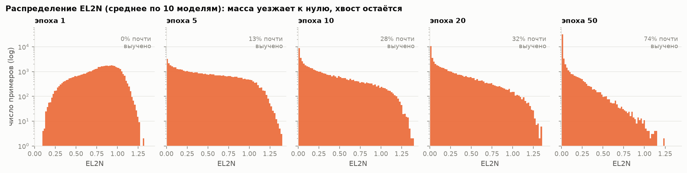

По ходу обучения масса распределения уезжает к нулю, но правый хвост почти не редеет:
доля примеров со скором <0.05 растёт 0% → 13% → 28% → 32% → 74% на эпохах 1/5/10/20/50,
а доля со скором >1.0 (уверенно неверный ответ) падает 14.4% → 2.2% к 20-й эпохе и
дальше почти не меняется. К 100-й эпохе сеть доучивается до 99.97% на трейне, и скор
вырождается: 99.9% примеров имеют EL2N < 0.05.

### 5.2 Усреднение по инициализациям обязательно

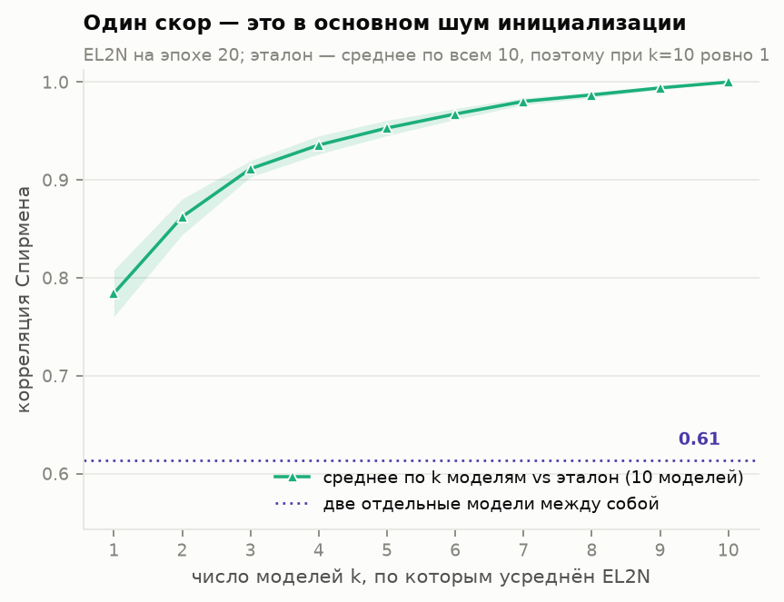

Два независимо обученных ResNet-18 дают EL2N, которые коррелируют между собой всего на
**ρ = 0.61** (Спирмен). Одна модель против среднего по десяти — **ρ = 0.78**; в статье для
GraNd при инициализации приводится ≈0.75, то есть порядок величины совпадает.
Корреляция выходит на 0.95+ только начиная с k = 5 моделей.

**Вывод воспроизводится:** усреднение по инициализациям — не косметика, а необходимая
часть метода, и именно она делает скоринг дорогим.

### 5.3 Все скоры ранжируют примеры почти одинаково

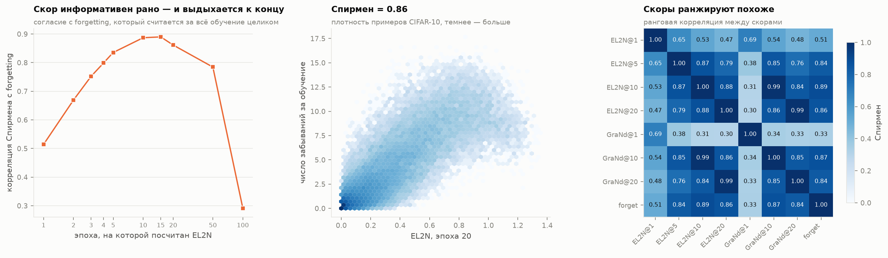

| пара | Спирмен |
|---|---|
| GraNd (эпоха 10) vs EL2N (эпоха 10) | **0.985** |
| GraNd (эпоха 20) vs EL2N (эпоха 20) | **0.987** |
| EL2N (эпоха 10) vs forgetting | 0.887 |
| EL2N (эпоха 20) vs forgetting | 0.861 |
| GraNd (эпоха 1) vs EL2N (эпоха 20) | 0.303 |

Первые две строки — это прямое экспериментальное подтверждение леммы из статьи:
если якобиан логитов по весам примерно одинаков у разных примеров, норма градиента по всем
11.2 M параметров и норма ошибки на логитах ранжируют примеры одинаково. Совпадение на
уровне 0.99 при том, что величины считаются совершенно по-разному (одна — через
per-sample градиенты, другая — одним прямым проходом), довольно убедительно.

Отдельно стоит **GraNd при инициализации**: он коррелирует со всем остальным лишь на
0.30–0.34. На первой эпохе ошибка на логитах почти одинакова у всех примеров, и норму
градиента определяет якобиан, а не ошибка — то есть GraNd на эпохе 1 меряет скорее
«нетипичность входа», чем сложность примера.

**Неожиданная деталь, которой нет в статье явно:** согласие EL2N с forgetting
немонотонно по эпохам — 0.51 (эпоха 1) → 0.89 (эпоха 10–15) → 0.86 (эпоха 20) →
0.78 (эпоха 50) → **0.29 (эпоха 100)**. Скор максимально информативен в начале-середине
обучения и полностью вырождается к концу, когда сеть доучивает трейн до нуля ошибок.
Это усиливает тезис статьи: ждать конца обучения не только дорого, но и вредно.

### 5.4 Что это за примеры

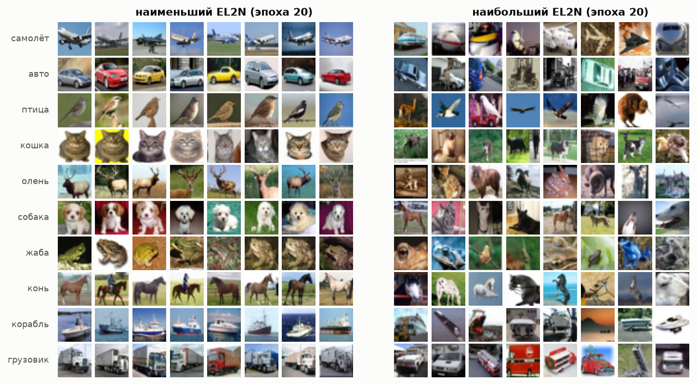

Качественно воспроизводятся рисунки 5–8 статьи: слева — канонические, крупные,
центрированные объекты на чистом фоне; справа — нестандартные ракурсы, перекрытия,
необычные цвета, объект на половину кадра, а также примеры, где метка выглядит
спорной (в строке «птица» справа видны кадры, больше похожие на машину; в строке
«кошка» — на собаку).

### 5.5 Главный результат: прунинг CIFAR-10

Девять долей данных × четыре способа отбора, у каждого запуска одинаковые 39 000 шагов и
одно lr-расписание. Скоры усреднены по 10 моделям (forgetting — по 6 полным запускам).

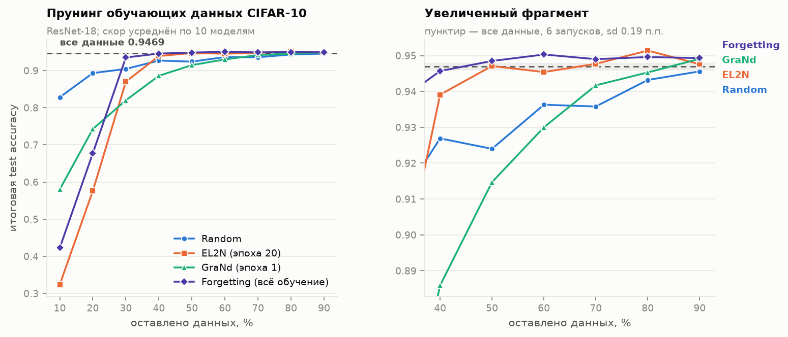

Итоговая test accuracy и разница с обучением на полных данных (94.69%, sd по сидам 0.19 п.п.):

| оставлено | random | EL2N эп. 20 | GraNd эп. 1 | forgetting |
|---|---|---|---|---|
| 10% | 82.81 (−11.88) | 32.40 (−62.29) | 58.02 (−36.67) | 42.29 (−52.40) |
| 20% | 89.32 (−5.37) | 57.61 (−37.08) | 74.26 (−20.43) | 67.75 (−26.94) |
| 30% | 90.44 (−4.25) | 87.02 (−7.67) | 81.99 (−12.70) | 93.52 (−1.17) |
| 40% | 92.69 (−2.00) | 93.91 (−0.78) | 88.59 (−6.10) | 94.57 (−0.12) |
| **50%** | 92.40 (−2.29) | **94.71 (+0.02)** | 91.47 (−3.22) | **94.85 (+0.16)** |
| 60% | 93.63 (−1.06) | 94.54 (−0.15) | 93.00 (−1.69) | 95.03 (+0.34) |
| 70% | 93.58 (−1.11) | 94.77 (+0.08) | 94.17 (−0.52) | 94.90 (+0.21) |
| 80% | 94.32 (−0.37) | **95.14 (+0.45)** | 94.53 (−0.16) | 94.96 (+0.27) |
| 90% | 94.56 (−0.13) | 94.76 (+0.07) | 94.91 (+0.22) | 94.93 (+0.24) |

**Центральное утверждение статьи воспроизводится точно.** По EL2N, посчитанному на 20-й
эпохе, можно выбросить **половину CIFAR-10** и получить 94.71% против 94.69% на полных
данных — разница +0.02 п.п. при шуме по сидам 0.19 п.п., то есть ровно «без потери
качества». Формулировка статьи «prune half of CIFAR10 while slightly improving test
accuracy» тоже подтверждается, но максимум достигается не на 50%, а на **80% (95.14%,
+0.45 п.п.)** — это больше двух sd базовой линии.

Случайный отбор той же доли даёт 92.40%, то есть **EL2N выигрывает у случайного прунинга
2.3 п.п. при 50% данных**. Разрыв между EL2N и random держится в районе 1–2 п.п. на всём
диапазоне 40–70%.

Forgetting-скор оказался чуть сильнее EL2N (94.85% против 94.71% на 50%, и он единственный
держится на 30% данных с потерей всего 1.2 п.п.). Это согласуется со статьёй: forgetting —
сильный бейзлайн, но он требует полного обучения, тогда как EL2N снимается за 20 эпох из
100 и проигрывает ему в пределах 0.2 п.п.

**Обвал на малых долях** — это тот же эффект, что статья изучает скользящим окном
(раздел 5.8). Если оставить только 10–20% самых сложных примеров, качество рушится
катастрофически: EL2N даёт 32.4% при 10% данных, тогда как случайные 10% дают 82.8%.
Отбор «только самое сложное» хуже случайного вплоть до ~30% данных.

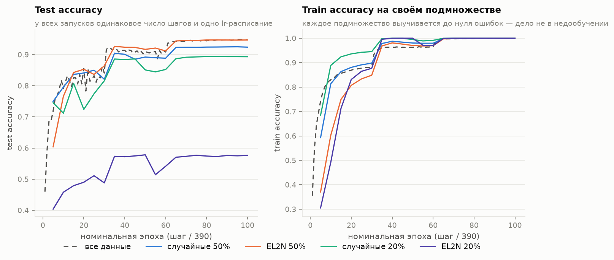

Правая панель показывает, что дело не в недообучении: каждое подмножество выучивается до
100% train accuracy на самом себе. EL2N-20% достигает нуля ошибок на своих 10 000 примерах
и при этом даёт 57.6% на тесте — отобранные примеры просто не описывают распределение.

### 5.6 GraNd на первой эпохе не работает

Отдельный результат, который **не воспроизвёлся**: GraNd, посчитанный на 1-й эпохе,
заметно хуже и EL2N, и даже случайного отбора на всём диапазоне 30–70% (при 50% данных —
91.47%, что на 0.9 п.п. хуже случайных 50%).

Причина видна из раздела 5.3: GraNd на эпохе 1 коррелирует с остальными скорами лишь на
0.30–0.34, тогда как GraNd на эпохе 20 коррелирует с EL2N на эпохе 20 на **0.987**. На
первой эпохе вектор ошибки почти одинаков у всех примеров, и норму градиента определяет
якобиан логитов по весам, то есть скорее «нетипичность входа», чем сложность примера.

Чтобы отделить «GraNd не работает» от «эпоха 1 слишком рано», мы прогнали ту же сетку с
GraNd, посчитанным на 20-й эпохе:

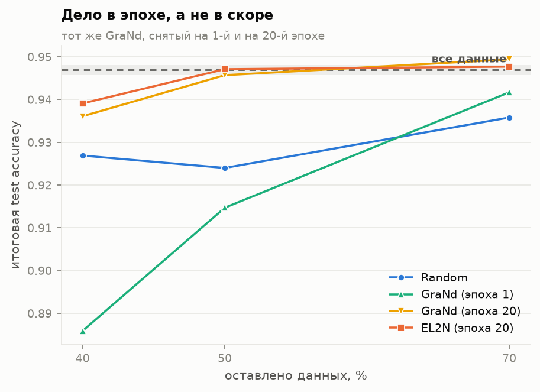

| оставлено | GraNd эп. 1 | **GraNd эп. 20** | EL2N эп. 20 | random |
|---|---|---|---|---|
| 40% | 88.59% | **93.61%** | 93.91% | 92.69% |
| 50% | 91.47% | **94.57%** | 94.71% | 92.40% |
| 70% | 94.17% | **94.94%** | 94.77% | 93.58% |

**Вопрос закрыт: дело в эпохе, а не в скоре.** GraNd на 20-й эпохе идёт вровень с EL2N
(разница 0.1–0.2 п.п., внутри шума) и обгоняет случайный отбор на 2.2 п.п. при 50% данных,
тогда как GraNd на 1-й эпохе отстаёт от него же на 3.1 п.п. Практического смысла в GraNd
это всё равно не добавляет: на той эпохе, где он работает, он ранжирует так же, как EL2N,
а считается в 14 раз дольше (39 с против 2.8 с на модель).

### 5.7 Насколько рано можно считать скор

Фиксированное подмножество 50% CIFAR-10, отобранное по EL2N, посчитанному на разных эпохах
(скор каждый раз усреднён по 10 моделям):

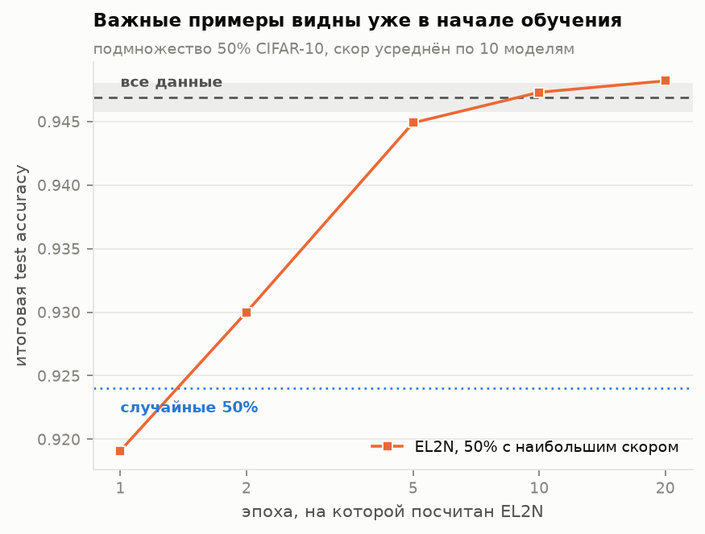

| эпоха, на которой посчитан EL2N | test accuracy | к базе (94.69%) |
|---|---|---|
| 1 | 91.91% | −2.78 п.п. |
| 2 | 93.00% | −1.69 п.п. |
| 5 | 94.49% | −0.20 п.п. |
| 10 | 94.73% | **+0.04 п.п.** |
| 20 | 94.82% | **+0.13 п.п.** |
| *случайные 50%* | *92.40%* | *−2.29 п.п.* |

**Воспроизводится.** Уже на 5-й эпохе из 100 скор обгоняет случайный отбор на 2.1 п.п. и
не дотягивает до полных данных всего 0.2 п.п.; на 10-й эпохе он полностью выходит на
уровень обучения на всех данных. Это 10% бюджета обучения — ровно тот порядок, который
заявлен в статье (там скор снимают на 20-й эпохе из 200).

Первая эпоха — ещё рано: 91.91%, хуже случайного отбора. Это тот же эффект, что с GraNd на
эпохе 1 (раздел 5.6): за одну эпоху ошибка почти не успевает расслоиться по примерам.

### 5.8 Скользящее окно на чистых метках: подтвердить не удалось

Статья (рис. 2) утверждает, что при фиксированном размере подмножества оптимально выбросить
не только лёгкие примеры, но и несколько сотен *самых сложных* — оптимум приходится
примерно на «выбросить топ-500». Мы повторили этот эксперимент один-в-один: окно из 20 000
примеров (40% CIFAR-10) по рейтингу EL2N с 10-й эпохи, смещение окна от верхушки рейтинга.
Три спорные точки (0, 250, 500) прогнаны по два раза.

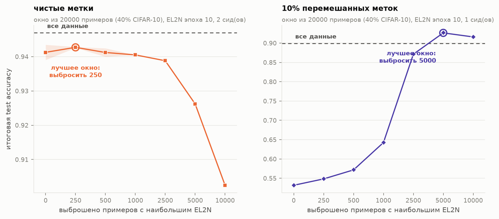

| выброшено верхних | запусков | test accuracy | разброс по сидам |
|---|---|---|---|
| 0 | 2 | 94.12% | 0.65 п.п. |
| 250 | 2 | **94.27%** | 0.04 п.п. |
| 500 | 2 | 94.12% | 0.36 п.п. |
| 1 000 | 1 | 94.05% | — |
| 2 500 | 1 | 93.88% | — |
| 5 000 | 1 | 92.62% | — |
| 10 000 | 1 | 90.25% | — |

**Вывод — «не удалось подтвердить», а не «опровергнуто».** Формально максимум приходится на
offset 250, то есть в ту же сторону, что и в статье. Но разброс по сидам на подмножестве из
20 000 примеров достигает **0.65 п.п.** — втрое больше, чем sd базовой линии на полных
данных (0.19 п.п.), — тогда как разница между offset 0, 250 и 500 составляет всего
0.15 п.п. Эти три точки нашими данными **не различаются**: чтобы разрешить эффект такого
масштаба, нужно порядка десяти запусков на точку, а не два.

Что видно уверенно и не зависит от шума: начиная примерно с 2 500 выброшенных примеров
качество падает монотонно и сильно (−4.2 п.п. при 10 000). То есть вторая половина
утверждения статьи — «самые сложные примеры всё-таки нужны» — подтверждается, а вот
локальный оптимум в районе нескольких сотен лежит ниже нашего разрешения.

Зато на зашумлённых данных тот же эксперимент даёт эффект, который ни с каким шумом не
спутать (раздел 5.11).

### 5.9 Контроль: что делают два отличия протокола

От статьи мы отошли в двух местах — 100 эпох вместо 200 и bf16 вместо fp32. Оба отличия
проверены отдельными контрольными запусками.

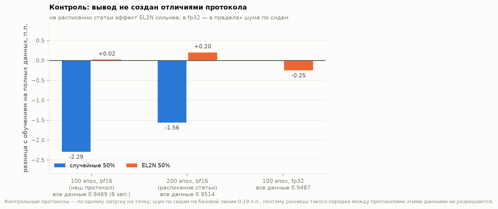

| протокол | все данные | EL2N 50% | EL2N 50% − все данные |
|---|---|---|---|
| наш: 100 эпох, bf16 | 94.69% (6 запусков) | 94.71% | **+0.02 п.п.** |
| расписание статьи: 200 эпох, bf16 | 95.14% | 95.34% | **+0.20 п.п.** |
| 100 эпох, fp32 | 94.87% | 94.62% | **−0.25 п.п.** |

**Длина обучения: отличие работает против нас.** На полном 200-эпохном расписании статьи
эффект не исчезает, а усиливается: EL2N на половине данных даёт 95.34% против 95.14% на
всех. То есть сокращение обучения вдвое **занижает** воспроизводимый эффект, а не создаёт
его. Заодно база на 200 эпохах (95.14%) попадает ровно в приводимое статьёй значение для
ResNet-18 на CIFAR-10 — порт воспроизводит и абсолютный уровень качества, а не только
относительные различия.

**Точность вычислений: отличие неразрешимо на одном запуске.** В fp32 обучение на всех
данных дало 94.87%, а на EL2N-половине — 94.62%, то есть −0.25 п.п. вместо +0.02 п.п. в
bf16. Разница между двумя этими дельтами — 0.27 п.п., что сопоставимо с одним sd шума по
сидам (0.19 п.п. на полных данных и заметно больше на подмножествах, см. 5.8), а на каждую
fp32-точку у нас **по одному запуску**. Поэтому корректная формулировка такая: **контроль
не выявил влияния bf16 за пределами шума по сидам — обе точки лежат в пределах четверти
процента от обучения на полных данных, — но разрешить эффект величиной 0.2 п.п. одним
запуском нельзя.** Сильное утверждение «bf16 ни на что не влияет» этими данными не
подкреплено; подкреплено слабое: «ничего, что меняло бы вывод, не видно».

Заметим, что главный вывод работы устойчив к обоим отличиям: ни при одном из трёх
протоколов EL2N-подмножество из половины данных не проигрывает обучению на всех данных
больше чем на треть процента, тогда как случайная половина проигрывает 1.6–2.3 п.п.

### 5.10 Шум в метках ломает метод — и это воспроизводится в полный рост

10% меток CIFAR-10 переставлены внутри случайно выбранной доли (реально испорчено
**4 498 примеров = 9.00%**, остальные при перестановке случайно совпали). Скоринг (5 моделей)
и обучение проводились на одном и том же испорченном датасете.

Обучение на всех шумных данных даёт **89.92%** против 94.69% на чистых.

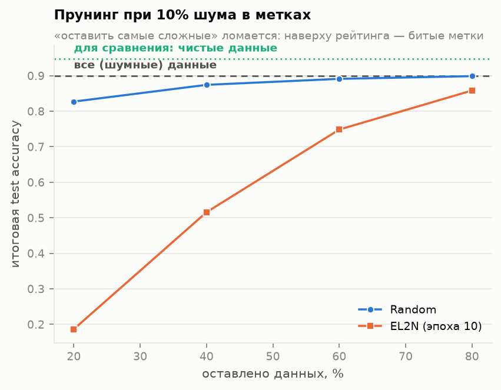

| оставлено | random | EL2N (эпоха 10) |
|---|---|---|
| 20% | 82.72% | **18.64%** |
| 40% | 87.43% | **51.57%** |
| 60% | 89.12% | **74.84%** |
| 80% | 89.88% | **85.83%** |

**Отбор «оставить самые сложные» проигрывает случайному на всех долях, причём
катастрофически.** При 20% оставленных данных EL2N даёт 18.6% против 82.7% у случайного
отбора — разрыв 64 п.п. Это сильнее, чем формулирует статья («эффект усиливается при
шуме»): на зашумлённых данных метод не просто теряет преимущество, а становится
значительно хуже случайного прунинга на всём проверенном диапазоне.

Причина прямо видна из того же скора.

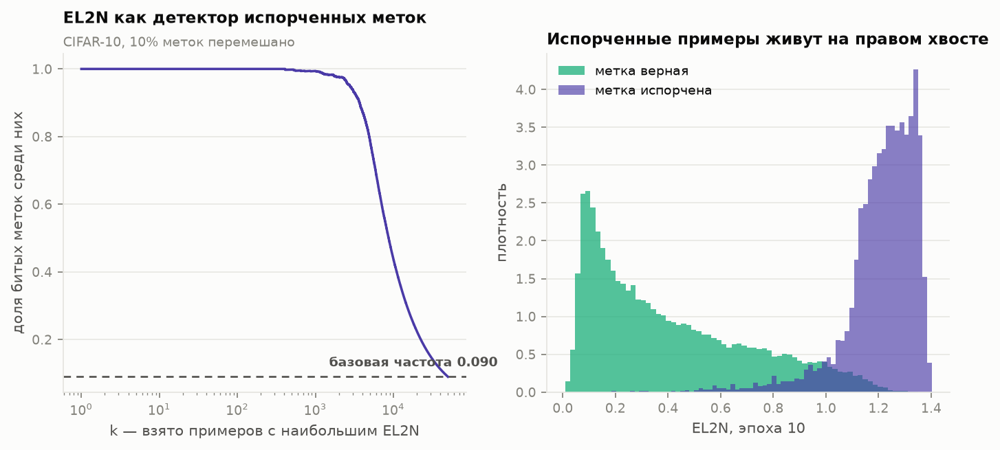

| k верхних по EL2N | доля испорченных среди них | полнота |
|---|---|---|
| 1 000 | **99.4%** | 22.1% |
| 2 500 | 96.2% | 53.5% |
| 4 500 (= число испорченных) | 83.6% | 83.7% |
| 10 000 | 43.8% | 97.4% |

Медианный ранг испорченного примера — **2 310** из 50 000; медианный ранг чистого —
27 244. Распределения EL2N у чистых и испорченных примеров разделены почти полностью:
испорченные собраны в районе 1.1–1.4, чистые — ниже 0.8.

Отсюда обе стороны одной медали:

* **как детектор разметки EL2N отличный** — среди тысячи примеров с наибольшим скором
  99.4% действительно имеют испорченную метку, причём получено это за 10 эпох обучения
  пяти моделей;
* **как критерий прунинга при шуме он непригоден** — «оставить верх рейтинга» означает
  ровно «оставить битые метки», что и даёт 18.6% при 20% данных.

Практический вывод: прежде чем применять EL2N-прунинг, верхушку рейтинга надо глазами
проверить на предмет ошибок разметки — а это, кстати, и есть самостоятельное применение
метода.

### 5.11 Скользящее окно при шуме: воспроизводится полностью

Тот же эксперимент со скользящим окном, что в разделе 5.8, но на зашумлённых данных —
то есть правая панель рис. 2 статьи. Окно из 20 000 примеров, рейтинг EL2N с 10-й эпохи,
посчитанный на тех же шумных метках.

| выброшено верхних | test accuracy | к offset 0 |
|---|---|---|
| 0 | 53.19% | — |
| 250 | 54.84% | +1.65 п.п. |
| 500 | 57.17% | +3.98 п.п. |
| 1 000 | 64.25% | +11.06 п.п. |
| 2 500 | 87.12% | +33.93 п.п. |
| **5 000** | **92.64%** | **+39.45 п.п.** |
| 10 000 | 91.59% | +38.40 п.п. |

**Воспроизводится, и очень убедительно.** Оптимум — выбросить **5 000** верхних примеров,
что практически точно совпадает с числом реально испорченных меток (**4 498**). Кривая
имеет выраженный максимум именно там, где заканчивается шум, и после него снова идёт вниз.

Самое интересное число здесь — абсолютное: в оптимуме получается **92.64%**, тогда как
обучение на **всех 50 000** шумных примеров даёт 89.92%. То есть правильно выбранные
20 000 примеров (40% данных) дают **+2.7 п.п. к обучению на всём датасете** — прунинг не
просто бесплатен, а полезен, если в данных есть мусор и его удаётся отрезать.

Сопоставление разделов 5.8 и 5.11 и объясняет, почему на чистом CIFAR-10 эффект еле заметен:
механизм «выбросить верхушку» работает ровно настолько, насколько наверху рейтинга лежит
что-то действительно вредное. На чистых метках там лежат просто трудные примеры, и
выигрыш исчезающе мал; при 9% битых меток там лежит мусор, и выигрыш достигает 39 п.п.

---

## 6. Итог: что воспроизвелось, а что нет

| утверждение статьи | статус | наши числа |
|---|---|---|
| EL2N (эпоха 20) позволяет выбросить **50% CIFAR-10** без потери качества | **воспроизведено** | 94.71% против 94.69%; на расписании статьи — 95.34% против 95.14% |
| умеренный прунинг **слегка улучшает** качество | **воспроизведено** | максимум 95.14% при 80% данных (+0.45 п.п., >2 sd) |
| скор информативен **уже через несколько эпох** | **воспроизведено** | эпоха 5 → 94.49%, эпоха 10 → 94.73% (уровень полных данных) |
| скор надо **усреднять по инициализациям** | **воспроизведено** | две модели между собой ρ=0.61; одна против 10 — ρ=0.78 (в статье ≈0.75) |
| GraNd и EL2N — по сути одна величина | **воспроизведено** | ρ=0.985 и 0.987 на эпохах 10 и 20; и на сетке прунинга идут вровень |
| оставлять **только самые сложные** примеры вредно | **воспроизведено** | 10% самых сложных → 32.4% против 82.8% у случайных 10% |
| при **шуме в метках** эффект усиливается | **воспроизведено, с запасом** | EL2N хуже случайного на всех долях; при 20% данных 18.6% против 82.7% |
| при шуме **оптимум окна смещается** вниз по рейтингу | **воспроизведено** | оптимум ровно на 5 000 выброшенных при 4 498 битых метках; +39 п.п. |
| оптимальное окно исключает топ-500 **на чистых метках** | **частично** | оптимум на 250, но выигрыш +0.15 п.п. — внутри шума 0.19 п.п. |
| **GraNd при инициализации** уже работает | **не воспроизведено** | GraNd эпохи 1 хуже случайного отбора на 30–70% данных |
| связь с NTK (kernel velocity, барьер связности) | не проверялось | бюджет |
| CIFAR-100 (25%), CINIC-10 (40%), перенос между архитектурами | не проверялось | бюджет |

### Что стоит за расхождениями

**GraNd на эпохе 1 — единственное настоящее расхождение.** И оно объяснено контрольным
экспериментом: тот же GraNd, посчитанный на 20-й эпохе, идёт вровень с EL2N (94.57%
против 94.71% при 50% данных) и обгоняет случайный отбор на 2.2 п.п. Не работает именно
самый ранний момент, потому что на первой эпохе вектор ошибки почти одинаков у всех
примеров и норму градиента определяет якобиан. Для практики это ничего не меняет: на
эпохе, где GraNd работает, он ранжирует так же, как EL2N, а считается в 14 раз дольше.

**Скользящее окно на чистых метках — вопрос статистической мощности, а не расхождение.**
По одному запуску на точку оптимум был в нуле; после второго сида он сместился на 250, то
есть в сторону, заявленную статьёй, но выигрыш (+0.15 п.п.) меньше шума по сидам
(0.19 п.п.). При этом **на зашумлённых данных тот же эксперимент воспроизводится с
огромным запасом** (+39 п.п., оптимум точно на числе битых меток). Механизм, который
описывает статья, реален; на чистом CIFAR-10 он просто слишком слаб, чтобы его увидеть
на нашем бюджете.

## 7. Чего этот отчёт не говорит

* Проверен **один датасет и одна архитектура**. Утверждения статьи про перенос скора между
  архитектурами и про CIFAR-100 / CINIC-10 / ImageNet здесь не проверялись.
* **По одному запуску на точку сетки** (исключения: базовая линия — 6 запусков, три
  ключевые точки окна — по 2). В статье на точку по 4 запуска. Разницы порядка 0.2 п.п.
  этими данными не разрешаются; шум по сидам измерен (0.19 п.п.) и указан везде, где это
  важно. Именно из-за этого вывод раздела 5.8 пришлось сформулировать как «направление
  согласуется, величина внутри шума», а не как «воспроизведено» или «опровергнуто».
* Обучение **100 эпох вместо 200**; три контрольные точки на полном расписании показывают,
  что это отличие занижает эффект, а не создаёт его, но вся сетка на 200 эпохах не
  прогонялась.
* Контроль **bf16 против fp32** сделан по одному запуску на точку и поэтому слабый: он
  показывает отсутствие эффекта за пределами шума по сидам, но не исключает влияния
  величиной ~0.2 п.п. (раздел 5.9).
* Раздел статьи про **NTK** (kernel velocity, барьер линейной связности) не воспроизводился.

## 8. Воспроизводимость самого отчёта

Всё, что выше, получено из **98 обучений (15.4 GPU-часа на одной RTX 3090)**:

```bash
uv sync
uv run scripts/sanity.py            # проверки порта + бенчмарк
uv run scripts/sweep.py --hours 11.5
uv run scripts/collect.py
uv run scripts/plots.py
uv run scripts/report_numbers.py    # все числа этого отчёта
```

| стадия | запусков | GPU-часов |
|---|---|---|
| scores (10 моделей × 20 эпох) | 10 | 0.62 |
| full (база + forgetting, 6 сидов) | 6 | 0.91 |
| **prune (основная сетка + GraNd эп. 20)** | **39** | **6.09** |
| score_epoch | 5 | 0.72 |
| offset (окно, чистые метки) | 10 | 1.92 |
| noise10 (скоринг, база, прунинг, окно) | 23 | 3.42 |
| verify200 (контроль расписания) | 3 | 0.86 |
| fp32 (контроль точности) | 2 | 0.90 |
| **итого** | **98** | **15.4** |

Оговорка про GPU-часы: часть запусков выполнялась после 11 часов непрерывной нагрузки и шла
примерно вдвое медленнее из-за троттлинга (8.6 мин на запуск против 18.4 мин для одной и той
же конфигурации; после паузы карта вернулась к 78 шагам/с). На «холодной» карте та же сетка
стоит около 12.5 GPU-часов. На результаты это не влияет — меняется только время, а не числа.

Каждый запуск сохраняет `args.json`, `metrics.csv` и `summary.json`; усреднённые скоры
лежат в `results/scores/*.npy`, сводная таблица — `results/summary.csv`, числа всех
рисунков — в `results/tables/`, а все числа этого отчёта — в
`results/tables/key_numbers.md`.
